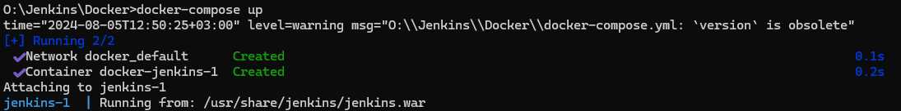
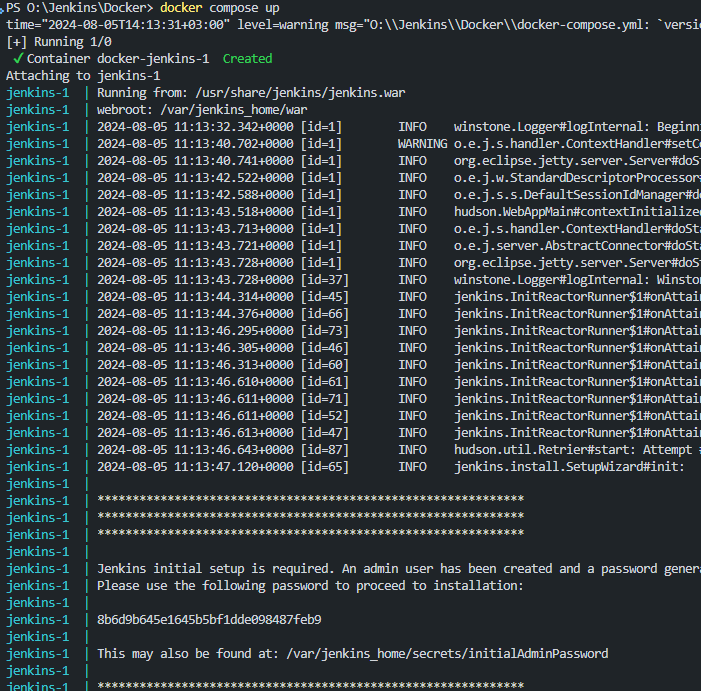

# Jenkins Docker Setup

## Volume Mapping

In the Docker Compose configuration, the volume mapping is set up as follows:

```yaml
version: '3.8'

services:
  jenkins:
    image: Brightskies_CI_Jenkins
    ports:
      - "8082:8080"
      - "50000:50000"
    volumes:
      - C:/Jenkin_Workspace:/jenkins_home
```

# Explanation
- **Volume Mapping:** The mapping `C:/Jenkin_Workspace:/jenkins_home` connects the `C:/Jenkin_Workspace` directory on your Windows host to the `/jenkins_home` directory inside the `Docker container`. This setup ensures that Jenkins will use C:/Jenkin_Workspace on your host system to store all its data, including job `configurations`, `build` artifacts, and `plugins`.
Benefits
- **Persistence:** By storing Jenkins data in C:/Jenkin_Workspace, all Jenkins-related information (such as jobs, configurations, and plugins) will persist even if the container is stopped or restarted. `This setup prevents data loss and ensures continuity of your Jenkins environment.`


This configuration helps maintain a stable and reliable Jenkins setup by ensuring that critical data is preserved and easily accessible.

----

- Build Them Image
```batch
docker build -t my-jenkins-image .
```
- then Run the compose 
```batch 
docker-compose up
```



- `docker exec -it docker-jenkins-1 sh`

- and Yup here we go:

