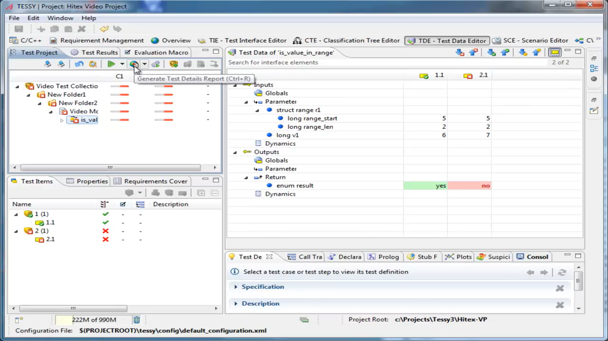

# SUT : Software Unit Test

#### **Techniques in Unit Testing**

- **White-box Testing:** Tests are based on knowledge of the internal logic of an application's code. This involves 
	- testing the structure, flow, and data within the unit.
	
- **Black-box Testing:** Tests are based on requirements and functionality without knowing the internal workings of the application.

- **Gray-box Testing:** Combines both white-box and black-box testing techniques.

#### **Writing Unit Tests in C**

- **Arrange, Act, Assert (AAA):** This is a common pattern used in unit tests.
    - **Arrange:** Set up the test environment and initialize objects.
    - **Act:** Execute the unit being tested.
    - **Assert:** Verify the result.
 
  
Planning the test cases
-------------------------


----

- assert:
    - `assert.h`
```c
    // arrange
    int expected = 5;
    // Act
    int result = add(a, b);

    /*
    * assert funtion:
    * it takes a condition as an argument and if the condition is false,
    * the program will terminate with an error message. 
    * Assertion failed: result == expected, line 37
    */
    assert(result == expected);
```
---
- Tessy:
    - SUI with Tessy
    



