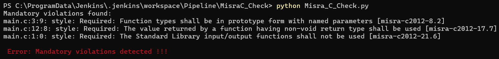
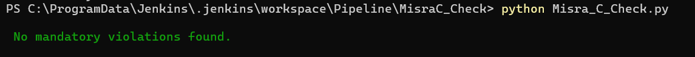
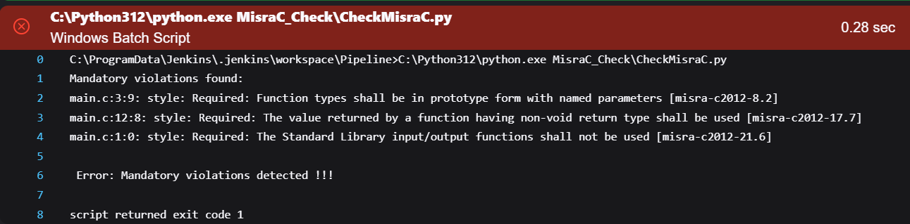
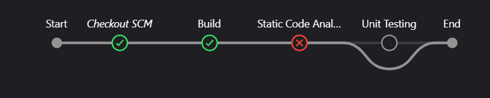
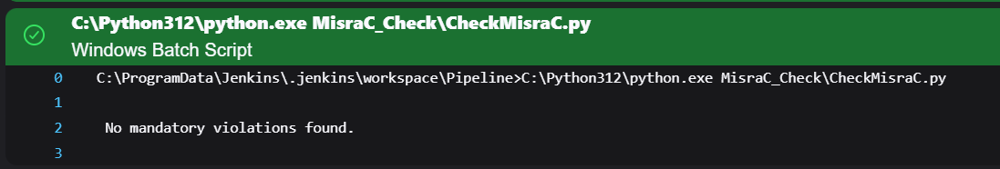
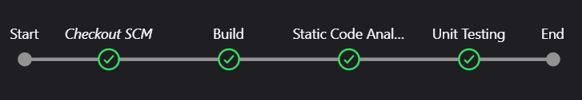

# Static Code Analysis:
## Using CppCheck

- Compiling and running a simple `main.c` file might work, but there could be hidden issues in the code. `Static code analysis tools can` help identify these problems before you even run the program.

```bash
O:\Jenkins>gcc main.c -o samiii

O:\Jenkins>samiii.exe
Hello, World.
```


```c
int main(){
        /*This is a wild Pointer */
        int *ptr;d

        int array[10];

        /*Out of Range*/
        array[100] = 30;

        printf("Hello, World. \n");
}
```

---
---

```bash
O:\Jenkins>cppcheck --enable=all main.c

Checking main.c ...
main.c:10:7: error: Array 'array[10]' accessed at index 100, which is out of bounds. [arrayIndexOutOfBounds]
 array[100] = 30;
      ^
main.c:10:13: style: Variable 'array[100]' is assigned a value that is never used. [unreadVariable]
 array[100] = 30;
            ^
main.c:5:7: style: Unused variable: ptr [unusedVariable]
 int *ptr;
      ^
nofile:0:0: information: Cppcheck cannot find all the include files (use --check-config for details) [missingIncludeSystem]

```


# Misra C 2012 Static Code analysis:

- Install cppcheck and add its `.exe` to your PATH
- clone this repo
```git 
git clone https://github.com/danmar/cppcheck/tree/main
```
- Add the addrons directory to the `cppcheck` directory
- Add the `JSON` file which include the path of the `misra.py` script and `Misra_C_2012_rules.txt`


```bash
cppcheck --addon="O:\Jenkins\misra.json" --enable=all --suppress=missingIncludeSystem main.c
```
- And yes it works

```bash

main.c:9:7: error: Array 'array[10]' accessed at index 100, which is out of bounds. [arrayIndexOutOfBounds]
 array[100] = 30;
      ^
main.c:2:9: style: Required: Function types shall be in prototype form with named parameters [misra-c2012-8.2]
int main(){
        ^
main.c:11:8: style: Required: The value returned by a function having non-void return type shall be used [misra-c2012-17.7]
 printf("Hello, World. \n");
       ^
main.c:1:0: style: Required: The Standard Library input/output functions shall not be used [misra-c2012-21.6]
#include <stdio.h>
^
```


----
----


# Parsing the Output for Jenkins Pipline:

-  Write the output to a txt file
```bash
cppcheck --addon="O:\Jenkins\misra.json" --suppress=missingIncludeSystem main.c > MisraCkOut.txt 2>&1
```
```bash
mkdir MisraC_Check
cd MisraC_Check"
```


- `CheckMisraC.py`: 
      - Check if the txt file contains a mandatory violation
      - Write the optimized output to a new file `OptimizedMisraCkOut.txt`
      - Print errors if there are mandatory violations

- Case (1):



- Case (2):



- Jenkins Dashboard:

> Just for prove of concept i inject in the python script to parse `Required` as a Mandatory rule and i remove it to check it again and it works :)


<div style="text-align: center; padding: 10px;">
  
</div>


<div style="text-align: center; padding: 10px;">
  
</div>

<div style="text-align: center; padding: 10px;">
  
</div>

<div style="text-align: center; padding: 10px;">
  
</div>
