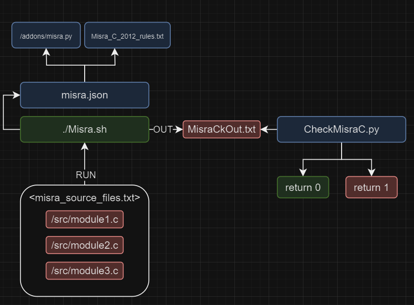

# Static Code Analysis:
## Using CppCheck
---
# Version 1.0
> Now we using cppcheck within the Dockerized Image `Brightskies CI Image`
- First Check the [Documentation](./Misra%20C%202012%20Static%20Code%20analysis.pdf)
- Cppcheck using addons for Misra C rules 2012 Static Code analysis



```bash
root@072fac8aff0e:/var/jenkins_home/MisraC# tree -L 1
.
├── CheckMisraC.py
├── Misra.sh
├── MisraCkOut.txt
├── Misra_C_2012_rules.txt
└── misra.json

1 directories, 6 files
```

| File                   | Description                                                                                      |
|------------------------|--------------------------------------------------------------------------------------------------|
| `CheckMisraC.py`       | Python script that parses `MisraCkOut.txt` and determines if mandatory MISRA C 2012 rule violations are present. |
| `Misra.sh`             | Bash script that automates MISRA C 2012 compliance checking using `cppcheck` with the `misra.json` configuration. |
| `MisraCkOut.txt`       | Output file generated by `cppcheck` that contains the results of the MISRA C 2012 compliance check. |
| `Misra_C_2012_rules.txt` | Text file containing the MISRA C 2012 rules for reference.                                       |
| `misra.json`           | JSON configuration file for `cppcheck` specifying the MISRA C 2012 rules to be applied.          |

## Usage:
```bash
/var/jenkins_home/MisraC/Misra.sh <misra_source_files.txt>
```

